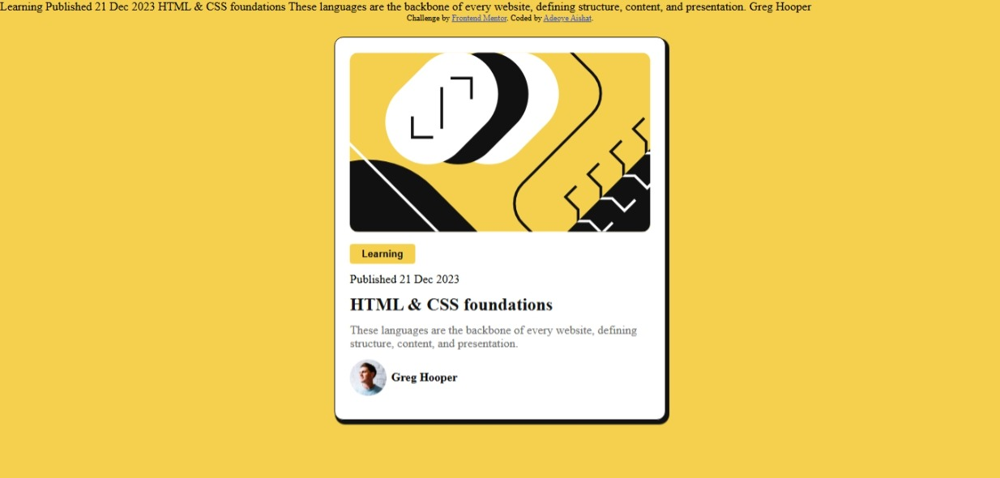

# Frontend Mentor - Blog preview card solution

This is a solution to the [Blog preview card challenge on Frontend Mentor](https://www.frontendmentor.io/challenges/blog-preview-card-ckPaj01IcS). Frontend Mentor challenges help you improve your coding skills by building realistic projects.

## Table of contents

- [Overview](#overview)
  - [The challenge](#the-challenge)
  - [Screenshot](#screenshot)
  - [Links](#links)
- [My process](#my-process)
  - [Built with](#built-with)
  - [What I learned](#what-i-learned)
  - [Continued development](#continued-development)
  - [Useful resources](#useful-resources)
- [Author](#author)
- [Acknowledgments](#acknowledgments)

## Overview

## Welcome! 👋

Thanks for checking out this front-end coding challenge.

### The challenge

The challenge is building out a blog preview card and get it looking as close to the design as possible.

### Screenshot

### Links

- Solution URL: [https://creative-tobi.github.io/Preview/](https://creative-tobi.github.io/Preview/)
- Live Site URL: [https://frontend-preview.netlify.app/](https://frontend-preview.netlify.app/)

## My process

### Built with

- Semantic HTML5 markup
- CSS custom properties
- Flexbox
- Mobile-first workflow

### What I learned

- Improved my understanding of HTML structure for clean, semantic layout
- Practiced using CSS for layout and styling, especially margin, padding, and alignment
- Learned how to create a responsive card component
- Strengthened my use of Flexbox to center content
- Enhanced attention to design details like  spacing, and color consistency
- Gained more confidence in working with real-world design challenges

## Author

- Website - [Creative-tobi](https://frontend-preview.netlify.app/)
- Frontend Mentor - [@Creative-tobi](https://www.frontendmentor.io/profile/Creative-tobi)
- Twitter - [@yaish15294](https://x.com/aish15294)
